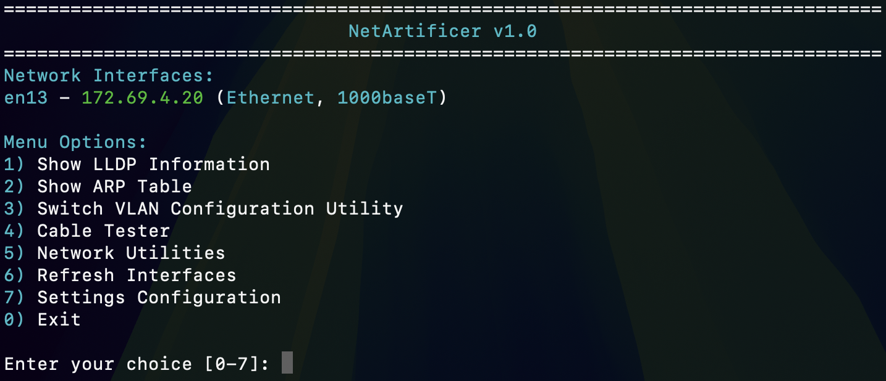
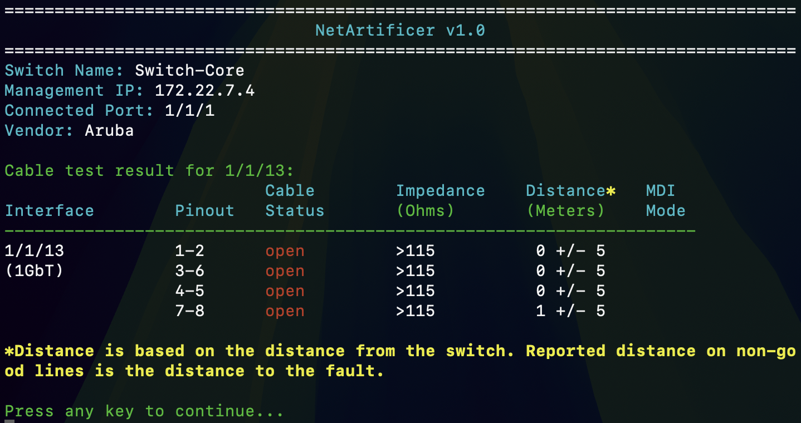
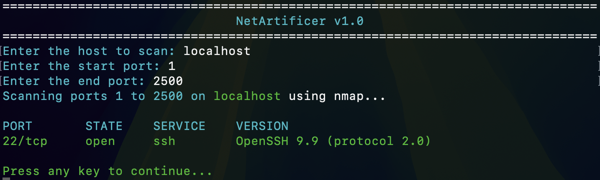
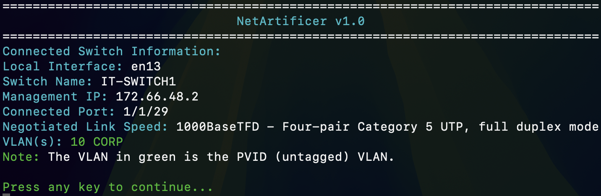

# NetArtificer

NetArtificer is a Bash-powered network toolkit for quick diagnostics, switch wrangling, and troubleshooting. It's menu-driven, works on Linux and macOS, and is mostly tested on Aruba switches (Cisco/Netgear support is there, but not guaranteed—I've only got Aruba gear to play with!).

## Why use NetArtificer?
- **Super Readable Output:** All results are color-coded, formatted, and organized for humans—not just dumped like raw CLI output. You get banners, tables, and clear prompts, so you always know what's going on.
- **User-Friendly Menus:** No need to memorize commands or flags. The interactive menus guide you through every step, with helpful warnings and confirmations.
- **Cleaner Than the CLI:** Instead of sifting through walls of text, NetArtificer highlights the important stuff and makes it easy to spot errors, warnings, and results at a glance.

## What can it do?
- Run cable diagnostics (TDR) on supported switches
- VLAN config helper
- LLDP and ARP info
- Show network interfaces
- Ping, traceroute (MTR), DNS lookup, port scan, ping sweep
- Wake-on-LAN, speed test, WHOIS, SNMP monitoring
- Interactive menu or command-line flags
- Tries to auto-detect switch info via LLDP
- Logging (kinda basic for now, but will improve)

## Planned Features
- Much better, more detailed logging (with log levels and filtering)
- Real Cisco and Netgear switch support (tested and robust)
- More automatic detection and error handling
- Plugin/extension system for adding new tools easily
- Automatic menu generation from tools directory
- More output formatting
- Updater function for easy upgrades
- More network utilities and switch vendor support

## Requirements
- Bash (Linux or macOS)
- Dependencies: lldpd, ssh, arp, awk, sed, grep, ping, dig, sshpass, wakeonlan, speedtest-cli, nmap, mtr, snmpget, whois
- If you're on macOS (with Homebrew) or Linux (with apt), missing dependencies are auto-installed for you!

## Installation
1. Clone this repo:
   ```sh
   git clone https://github.com/nathanakalish/netartificer.git
   cd netartificer
      ```
   2. Make the main script executable:
   ```sh
   chmod +x netartificer.sh
   ```
3. Run it:
   ```sh
   sudo ./netartificer.sh
   ```
   (Root is needed for some network stuff.)

4. The script checks for dependencies and will offer to install anything missing.

## Usage
- Run with no arguments for the menu.
- Use `--help` for command-line options.
- You can type `qq` at most prompts to bail out to the main menu.

## Screenshots

Here are some screenshots of NetArtificer in action:






## Notes & Warnings
- **Cisco and Netgear support is experimental!** I only have Aruba switches to test on, so YMMV with other vendors.
- **Logging is pretty basic right now.** It appends to a log file, but doesn't log everything. I'll be making it more useful soon.
- No hardcoded secrets or passwords in the code. SSH creds are prompted and not saved.
- Log files/settings.conf might have sensitive info (like switch IPs/usernames). Don't upload those to public repos.
- You can add your own tools by dropping Bash scripts in the `tools/` folder.

## License
MIT License (see LICENSE)

## Disclaimer
Use at your own risk! This is a toolkit for network folks, but always test in a safe environment before using on production gear. If you break your network, that's on you :)
